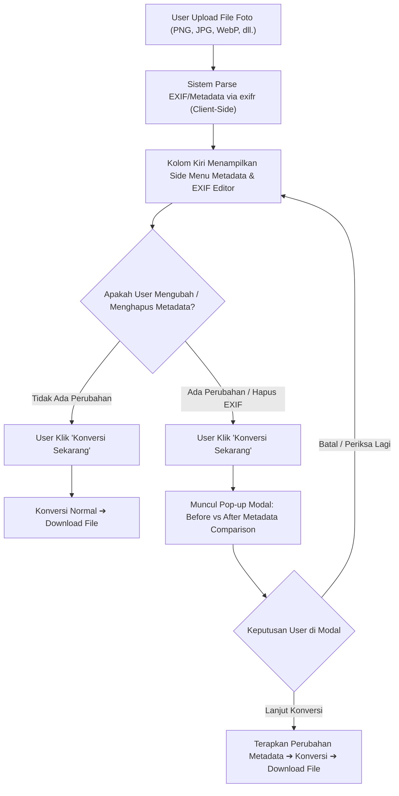

# Product Requirements Document (PRD)
## Fitur: EXIF & Metadata Inspector/Editor dengan Before-After Modal

---

## 1. Ringkasan Eksekutif (Executive Summary)
Fitur **EXIF & Metadata Inspector/Editor** memungkinkan pengguna melihat, mengedit, dan membersihkan metadata tersembunyi (seperti data kamera, lokasi GPS, tanggal pengambilan, dan hak cipta) langsung di sisi browser (*Client-Side*) saat file gambar diunggah.

Ketika ada perubahan pada metadata sebelum proses konversi, sistem akan memunculkan **Modal Komparasi Before vs After** untuk memastikan transparansi dan memberikan kontrol penuh kepada pengguna sebelum file hasil diunduh.

---

## 2. Masalah yang Diselesaikan (Problem Statement)
1. **Privasi & Keamanan Data Pengguna:** Foto dari smartphone (iPhone/Android) secara default menyimpan koordinat GPS lokasi rumah/kantor dan identitas perangkat. Banyak pengguna tidak menyadari data sensitif ini ikut terkirim.
2. **Kebutuhan Profesional & Kreator:** Fotografer dan desainer ingin menambahkan informasi hak cipta (*Copyright*), nama fotografer (*Artist/Author*), atau menyesuaikan deskripsi foto sebelum dikonversi dan dibagikan.
3. **Transparansi Perubahan:** Pengguna membutuhkan konfirmasi visual yang jelas mengenai data apa saja yang berubah atau dihapus sebelum file diproses.

---

## 3. Alur Pengguna (User Flow)

---

## 4. Spesifikasi Fungsional (Functional Requirements)

### 4.1. Side Menu: Metadata & EXIF Inspector (Kolom Kiri)
* **Trigger:** Muncul secara otomatis menggantikan placeholder iklan kiri (*left aside*) saat ada 1 file foto yang aktif diunggah.
* **Informasi yang Ditampilkan (Read-Only):**
  * **File Info:** Nama file, ukuran file, resolusi (Width × Height), MIME Type, tanggal modifikasi.
  * **Device & Camera Info:** Make (merek kamera/HP), Model (tipe perangkat), Software/OS.
  * **Shot Details:** Tanggal pengambilan (*DateTimeOriginal*), F-Number (aperture), Exposure Time, ISO, Focal Length.
  * **Location / GPS:** Koordinat Latitude & Longitude (disertai indikator status *"GPS Aktif"* atau *"Tanpa GPS"*).
* **Fitur Edit (Interactive Fields):**
  * **Custom Device & Camera Editor:**
    * **Preset Perangkat Populer:** Dropdown pemilihan perangkat (iPhone 15 Pro Max, iPhone 14 Pro, Samsung Galaxy S24 Ultra, Google Pixel 9 Pro, Sony Alpha A7 IV, Canon EOS R5, Fujifilm X-T5, Nikon Z8).
    * Input teks bebas untuk *Merek Kamera/HP (Make)*, *Model Perangkat (Model)*, dan *Perangkat Lunak / OS (Software)*.
    * Tampilan visual chip perangkat aktif saat dipilih.
  * **Custom GPS & Location Editor:**
    * Input numerik kustom untuk *Latitude* (-90 s/d 90) dan *Longitude* (-180 s/d 180).
    * **Preset Kota Populer:** Dropdown pemilihan lokasi instan (Jakarta, Bandung, Surabaya, Denpasar/Bali, Yogyakarta, Tokyo, London, Singapore, New York) dengan nilai terpilih yang menetap dan disertai chip status lokasi aktif.
    * **Tombol "Lokasi Saya":** Mengambil koordinat perangkat pengguna secara akurat via Browser Geolocation API.
    * **Pratinjau Google Maps:** Tautan langsung membuka koordinat di Google Maps untuk verifikasi visual.
    * **Tombol "Hapus GPS":** Menghapus koordinat lokasi secara instan untuk perlindungan privasi.
  * Input edit untuk: *Artist / Fotografer*, *Copyright*, dan *Image Description*.
  * **Tombol Cepat "Bersihkan Semua Metadata" (Strip Metadata):** 1 klik untuk menghapus seluruh data lokasi GPS dan kamera demi privasi.
  * Indikator status perubahan: Badge *"Ada Perubahan"* muncul jika data telah diubah dari nilai aslinya.

### 4.2. Modal Pop-up: Before vs After Comparison
* **Trigger:** Terbuka ketika user mengklik tombol **"Konversi Sekarang"** HANYA jika `hasMetadataChanges === true`.
* **Komponen Modal:**
  * **Header:** Judul "Konfirmasi Perubahan Metadata" dan deskripsi singkat.
  * **Tabel Perbandingan (Diff View):**
    * Kolom 1: Nama Properti (misal: *Artist*, *GPS Location*, *Copyright*).
    * Kolom 2: Nilai Asli (*Sebelum / Original*).
    * Kolom 3: Nilai Baru (*Sesudah / Modified* atau badge merah *"Dihapus"*).
  * **Action Buttons:**
    * Tombol **"Batal"**: Menutup modal dan kembali ke halaman editor untuk penyesuaian.
    * Tombol **"Lanjut Konversi"**: Menerapkan perubahan metadata dan melanjutkan proses konversi file.

---

## 5. Spesifikasi UI/UX & Desain (Design Guidelines Compliance)

Sesuai aturan baku di [DESIGN_RULE.md](file:///d:/Nanang%20Nurmansah/Coba-Cute/Converter_File/DESIGN_RULE.md):
1. **Anti-Slop Rule:** Dilarang keras menggunakan emoji bawaan OS. Gunakan inline SVG bersih (stroke-width: 1.5 atau 2) dengan palet monokrom/indigo.
2. **Color Palette:**
   * Primary Button: `#4F46E5` (Hover: `#4338CA`)
   * Background Card: `#FFFFFF` dengan border `#E5E7EB`
   * Muted Text: `#6B7280` / `#9CA3AF`
   * Alert/Diff Badge: Merah halus untuk penghapusan data (`#FEE2E2` / `#B91C1C`), Hijau halus untuk data baru (`#ECFDF5` / `#047857`).
3. **Responsivitas (Mobile-First):**
   * **Desktop (`lg` breakpoint ke atas):** Side Menu menempati kolom kiri (lebar 280px - 320px) yang elegan dengan sticky positioning.
   * **Mobile / Tablet (`< lg`):** Side menu ditampilkan sebagai panel akordeon atau tombol expandable *"Lihat & Edit Metadata"* tepat di bawah Dropzone agar layout tidak sempit dan tetap nyaman di smartphone.

---

## 6. Arsitektur Teknis & Dependensi

* **Parser:** Menggunakan library **`exifr`** (`^7.1.3`) yang sudah terinstall di `package.json`.
* **Code Splitting:** Modul parsing EXIF dimuat secara asynchronous (*dynamic import*) hanya ketika file pertama kali diunggah, sehingga bundle awal web tetap ringan.
* **State Management:**
  * `originalMetadata`: Snapshot metadata awal saat file dibaca.
  * `editedMetadata`: State reaktif yang menampung perubahan input dari user.
  * `hasMetadataChanges`: Boolean terkomputasi (`diff != empty`).
  * `showConfirmModal`: Boolean state untuk kontrol pop-up dialog.
* **Penerapan pada Konversi:**
  * Jika user memilih opsi *Strip Metadata*, konversi WASM/Canvas secara alami menghasilkan gambar bersih tanpa metadata.
  * Metadata baru diintegrasikan ke dalam metadata manifest hasil konversi.

---

## 7. Kriteria Penerimaan (Acceptance Criteria)

1. [x] Mengunggah file foto (JPG/PNG/WebP) otomatis memicu ekstraksi EXIF via `exifr`.
2. [x] Kolom kiri menampilkan seluruh data EXIF yang berhasil diekstrak dalam card yang rapi dan terorganisir per kategori (File, Kamera, GPS, Informasi).
3. [x] Pengguna dapat mengedit field teks dan mengklik tombol "Hapus Lokasi & EXIF".
4. [x] Jika ada perubahan dan tombol "Konversi Sekarang" diklik, modal Before-After muncul menampilkan perbandingan field yang diubah.
5. [x] Jika tidak ada perubahan, proses konversi berjalan langsung tanpa memunculkan modal.
6. [x] Di layar mobile (< 768px), antarmuka metadata tidak merusak layout 1 kolom dan dapat dibuka-tutup dengan mudah.
7. [x] Build `npm run build` dan `npm run lint` lulus 100% tanpa error maupun warning.
